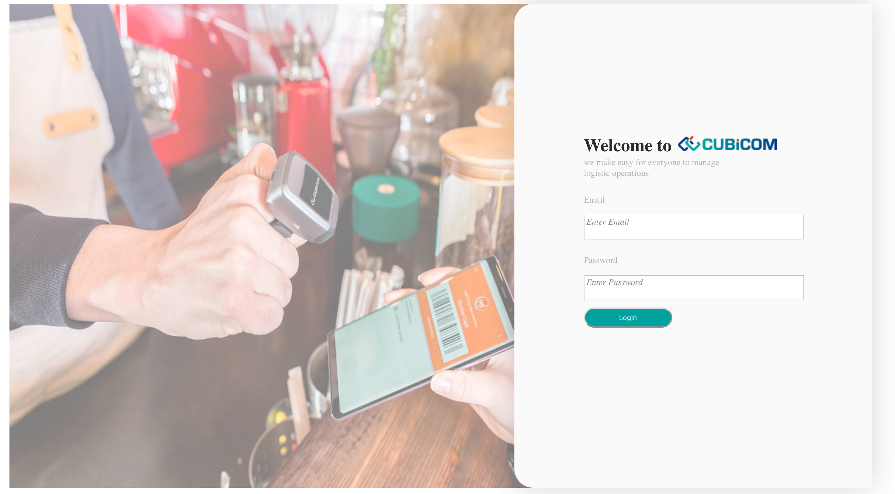
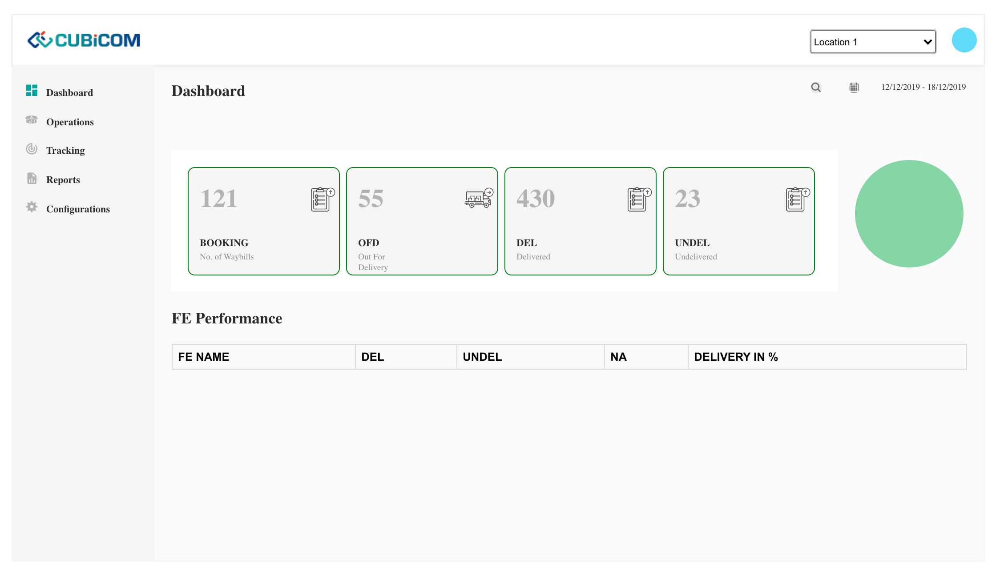

# cubicom-auth

  
Home Page:

  

 

  
Dashboard:

  

### How to run
* Clone the repo
* run "npm install"
* run "npm start"
* Provide login details as email: "cubicom",password :"password"
* On Successful login, you will be redirected to Dashboard
* Complete ReadMe of Create-React-App can be found Inside

